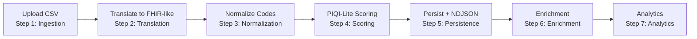
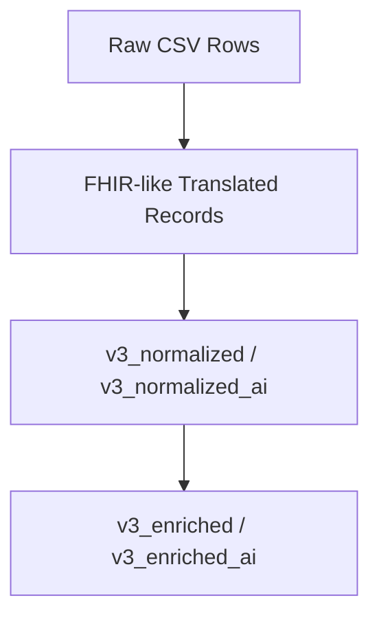
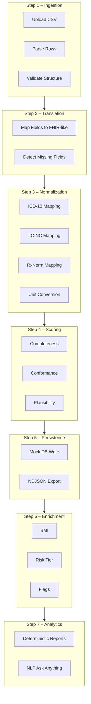
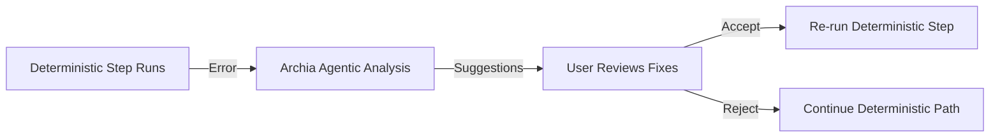

# Oros Health Data Pipeline Wizard (v3) — Overview & Index

This repository contains the **modular 7-step pipeline wizard** used to ingest, translate, normalize, score, enrich, persist, and analyze healthcare data (for the demo: synthetic CSVs).  
It supports **deterministic processing** and optional **agentic fallback workflows** via Archia.

This README provides:

- A unified architecture overview  
- A full step index (Steps 1–7)  
- Mermaid diagrams (pipeline, architecture, data flow)  
- Deterministic vs agentic behavior rules  
- UX conventions for the wizard  
- Archia integration contract  
- Dataset versioning rules  
- Developer onboarding  
- Links to step specifications  
- Optional references (Miro board, future PIQI Diabetes Rubric)  

This is the **source of truth** for engineers implementing v3.

---

# 1. High-Level Concept

The Pipeline Wizard is a **single-page, step-driven UI** that walks users through:

1. **Ingestion** (CSV → internal raw rows)  
2. **Translation** (raw rows → FHIR-like records)  
3. **Normalization** (value mapping → ICD-10, LOINC, RxNorm, units)  
4. **Scoring** (PIQI-lite DQ metrics)  
5. **Persistence** (mock DB + NDJSON export)  
6. **Enrichment** (BMI, risk strata, diabetes heuristics)  
7. **Analytics** (deterministic dashboards + optional NLP “Ask Anything”)  

At each stage, failures can trigger **agentic analysis** (if AI is enabled).  
Deterministic processing remains the authoritative system of record.

---

# 2. Quick Navigation — Step Specifications

Click into any step for full detail:

| Step | File | Purpose |
|------|------|---------|
| **01 — Ingestion** | [pipeline-specs/step01-ingestion.md](pipeline-specs/step01-ingestion.md) | Upload CSV, parse into raw rows, detect ingestion errors |
| **02 — Translation** | [pipeline-specs/step02-translation.md](pipeline-specs/step02-translation.md) | Map raw fields to FHIR-like structure (demo) |
| **03 — Normalization** | [pipeline-specs/step03-normalization.md](pipeline-specs/step03-normalization.md) | Map codes & units to ICD-10, LOINC, RxNorm; produce structured clinical data |
| **04 — Scoring** | [pipeline-specs/step04-scoring.md](pipeline-specs/step04-scoring.md) | PIQI-lite completeness, conformance, plausibility scoring |
| **05 — Persistence** | [pipeline-specs/step05-persistence.md](pipeline-specs/step05-persistence.md) | Persist normalized data + NDJSON export |
| **06 — Enrichment** | [pipeline-specs/step06-enrichment.md](pipeline-specs/step06-enrichment.md) | BMI, BMI category, diabetes risk tier, cohort flags |
| **07 — Analytics** | [pipeline-specs/step07-analytics.md](pipeline-specs/step07-analytics.md) | Deterministic reports + AI chat surface |

---

# 3. Deterministic vs Agentic Behavior (Core Rules)

### Deterministic
- Always produces the authoritative dataset  
- Runs even when AI is disabled  
- User sees clear structured errors  
- No silent mutations  
- Dataset versions:  
  - `v3_normalized`  
  - `v3_normalized_ai`  
  - `v3_enriched`  
  - `v3_enriched_ai`  

### Agentic (Archia)
Triggered **only** when:
- A step errors  
- A user explicitly requests AI analysis  
- AI is enabled (`AI_ENABLED=true`)  

Agentic behavior:
- Diagnoses errors  
- Suggests root causes  
- Proposes patches  
- Provides reasoning narratives  
- Never silently changes data  
- Any “patched” dataset requires **user approval**  

All agentic interactions appear in a **right-hand side drawer**.

---

# 4. Top-Level Pipeline Diagram (High-Level Mermaid)



---

# 5. Deterministic + Agentic Architecture

```mermaid
flowchart TB

%% ---------------------------------
%% LAYOUT CONTROL
%% ---------------------------------
classDef box fill=#2e2e2e,stroke=#999,color=#fff,rx=4,ry=4
classDef label fill=transparent,stroke=transparent,color=#bbb

%% ---------------------------------
%% FRONTEND (FE)
%% ---------------------------------
subgraph FE["Frontend (React / Vite)"]
    FE1["Wizard UI<br/>Steps 1–7"]:::box
    FE2["Side Drawer<br/>Agentic Insights"]:::box
end
class FE label

%% ---------------------------------
%% BACKEND (BE)
%% ---------------------------------
subgraph BE["Backend (Node / TS)"]
    BE1["Deterministic Pipeline Engine"]:::box
    BE2["Archia Client"]:::box
end
class BE label

%% ---------------------------------
%% MAIN DATA FLOW
%% ---------------------------------
FE1 --> BE1
BE1 --> FE1

%% ---------------------------------
%% AGENTIC FALLBACK ON ERROR
%% ---------------------------------
BE1 -. "On error" .-> BE2
BE2 --> FE2

%% ------------------------------
%% AGENTIC FALLBACK ON ERROR
%% ------------------------------
BE1 -. "On error" .-> BE2
BE2 --> FE2
```

---

# 6. Dataset Versioning Model



Rules:
- Version suffix `_ai` only appears after a user accepts an AI patch  
- Analytics always operates on **currently active dataset**  
- Persistence step explicitly reports dataset version  

---

# 7. Archia Integration Contract

### Standard Request Payload

```json
{
  "step": "<step-name>",
  "ai_enabled": true,
  "errors": [],
  "sample_records": [],
  "context": {},
  "dataset_version": "v3_normalized",
  "metadata": {
    "runId": "2025-01-12T10:22:11Z"
  }
}
```

### Standard Response Shape

```json
{
  "root_cause": "...",
  "suggested_fixes": ["..."],
  "patched_rows": [],
  "insights": [],
  "step_by_step_report": "..."
}
```

---

# 8. UX Conventions (Consistent Across Steps)

### Side Drawer
Used for:
- Agentic insights  
- Root cause analysis  
- Proposed fixes  
- Narrative summaries  

### Bottom Status Bar
- Shows: Pending, Success, Warning, Error  
- Always visible  

### Run Step
- Runs only current step  

### Run All
- Sequentially executes downstream steps  

### Dataset Version Badge
- Shows dataset lineage at top-right of main pane  

### Analytics Tabs
- Tab 1: Deterministic Reports  
- Tab 2: Ask Anything (enabled only when AI_ENABLED=true)  

---

# 9. Developer Onboarding

### Run locally

```bash
npm install
npm run dev
```

### Enable/Disable AI

In `.env`:

```bash
AI_ENABLED=true
```

or

```bash
AI_ENABLED=false
```

### Test Clean vs Errorful CSV

We use two demo CSVs:

- Clean (runs end-to-end deterministically)  
- Errorful (triggers agentic fallback at Ingestion, Translation, or Normalization)  

Place them in:

```text
/demo-data/
```

---

# 10. Future Integration Slots

### PIQI Diabetes Rubric (Full Version)
- Will replace PIQI-lite logic in Step 4  
- Will live in: `/dq-rubrics/diabetes.json`  
- Will reference terminology service  

### Terminology Service
- ICD-10, LOINC, RxNorm  
- Future integration via `/services/terminology-client.ts`  

### Real Persistence Layer
- DuckDB or Postgres  
- Replace mock persistence in Step 5  

### RTA / HIE Integration
- Eventual API contract for ingestion  
- Patient registry alignment  
- Data Quality dashboards  

---

# 11. Additional Reference (Optional)

**Miro Board – Working Notes & Ideation**  
_(Exploratory, not source-of-truth)_  
https://miro.com/app/board/uXjVJOTpxV4=/?share_link_id=77225652384

---

# 12. Detailed Diagrams Appendix

(Full-size diagrams — ideal for Fibery import or engineering discussions.)

---

## 12.1 Full Pipeline (Expanded)



---

## 12.2 Agentic Fallback Routing


